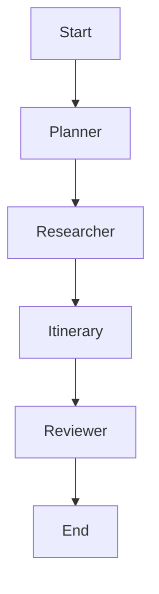

# 🌍 Smart Travel Planner


A **Multi-Agent AI Travel Planner** that designs your perfect trip. Built with **LangGraph**, **LangChain**, and **Streamlit**.

## ✨ Features

- **🤖 Multi-Agent Orchestration**: Four distinct agents (Planner, Researcher, Itinerary, Reviewer) collaborate to build your plan.
- **🗺️ Flexible Itineraries**: Supports planning trips from any **Origin** to any **Destination**.
- **📝 Narrative Plans**: Generates friendly, human-like itinerary descriptions with stories and emojis.
- **🎨 Interactive UI**: Clean Streamlit interface with sidebar controls for budget, duration, and locations.
- **⚡ Fast & Free Demo**: Uses **Mock Tools** to simulate flight/hotel data, ensuring a reliable demo experience without API keys or costs.

## 🚀 Quick Start

### 1. Install Dependencies
```bash
pip install -r requirements.txt
```

### 2. Run the Application
```bash
streamlit run app/main.py
```

## 🏗️ Architecture

The system uses a state graph to manage agent interactions:



### Agents
1.  **Planner**: Deconstructs your request into actionable steps.
2.  **Researcher**: Fetches flight options, hotel deals, and local activities.
3.  **Itinerary**: Weaves the data into a cohesive, narrative day-by-day plan.
4.  **Reviewer**: Validates the plan against your budget and constraints.

## 🛠️ Tools

To guarantee a smooth presentation, the project uses custom **Mock Tools** (`src/tools/mocks.py`). These return realistic dummy data, allowing you to demo the agentic behavior immediately after cloning.
