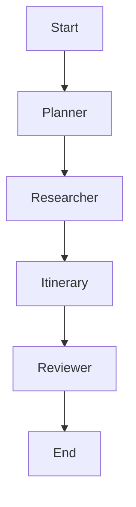

# 🌍 Smart Travel Planner

A Multi-Agent AI Travel Planner built with **LangGraph**, **LangChain**, and **Streamlit**.

## Overview

This project uses a graph of AI agents to plan your perfect trip:
1.  **Planner**: Breaks down your request.
2.  **Researcher**: Finds flights, hotels, and activities (using mock tools for demo).
3.  **Itinerary**: Compiles your schedule.
4.  **Reviewer**: Ensures the plan meets your criteria.

## Setup

1.  **Install Dependencies**
    ```bash
    pip install -r requirements.txt
    ```

2.  **Run the App**
    ```bash
    streamlit run app/main.py
    ```

## Architecture

The workflow is defined in `src/graph/workflow.py`. It uses a state machine to pass data between agents.



## Tools

To ensure a smooth demo experience without API costs, this project uses **Mock Tools** (`src/tools/mocks.py`) that simulate data from flight and hotel providers.
